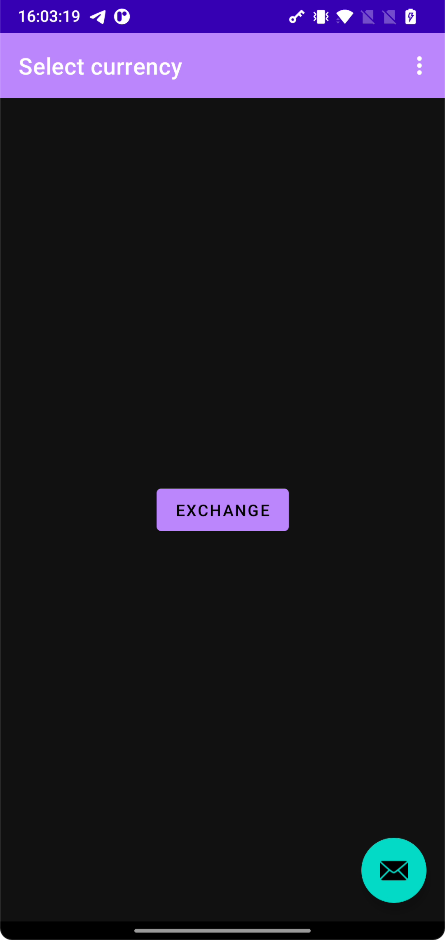
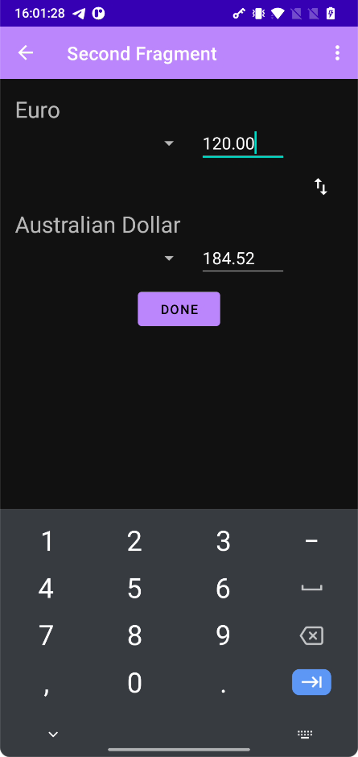

# Confero Android assignment

## Introduction
In this assignment you will need to build a simple currency exchange app.
We will be using a free REST api. Before starting, please get the api key here: https://currency.getgeoapi.com/account/

The app is going to have two screens
### First screen

Clicking on the button brings you to the exchange screen.

### Exchange screen (second screen)

## Functional requirements (Exchange screen)
 - Load available currencies once the screen is opened. https://api.getgeoapi.com/v2/currency/list.
 - Display the loaded list of currencies in both spinners. Yoy may use currency code for the spinner and display name for the title above.
 - Whenever amount is entered into one field, calculate the amount in the other currency. https://api.getgeoapi.com/v2/currency/convert
 - Pressing "swap" should swap the selected currencies and update value fields.
 - Pressing "Done" should display a success dialog. Feel free to style it as you want.
 - Optional: Persist currency list and last used currency pair.
 - Optional: Make it look nicer. Animations, colors, BottomSheetDialog are all welcome.

## Technical requirements
 - Preferably: Kotlin
 - Preferably: DI with Hilt, Retrofit
 - Preferably: Use reactive programming with Kotlin flows to minimize callbacks. You may use provided `bind` method.
 - Must: MVVM
 - Must: Show loading overlays when something is loading; Show error message if network is not available.
 - Must: Keep the code clean and well organized. Follow best coding practices.
 - Must: Make sure to save instance state on activity restart.

You may add cool things according to your taste and change requirements slightly as long as you produce a usable and pleasant currency exchange interface. 

## Submitting
Once you are done:

1. Please upload your code to a private Github repository. Include your name in the Readme. 
2. Add me (dshatz) as a repo collaborator.
3. Build an APK and send the solution to your contact person.

In case of questions please contact daniels.satcs@confero.tech